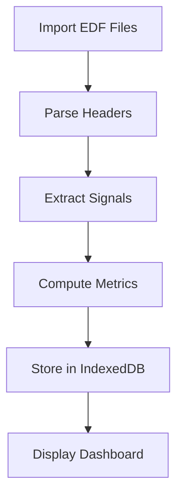

# Documentation Strategy — CPAP Analyzer

**Version**: 1.0  
**Last Updated**: February 10, 2026  
**Status**: Architecture Decision Record  
**Audience**: Documentation, UX, Frontend, all implementation agents

## Executive Summary

This document defines the complete documentation strategy for CPAP Analyzer, a client-side clinical data analysis platform for CPAP therapy patients. The documentation system serves dual audiences—technically sophisticated patients and dedicated laypersons—while maintaining regulatory-grade quality standards and WCAG AA accessibility compliance.

Documentation is not an afterthought but a **first-class product feature**. It transforms the application from a tool into a learning platform, enabling patients to understand their therapy at the level of a sleep scientist.

### Core Documentation Principles

1. **Clinical Precision** — Every metric, algorithm, and interpretation must be medically and statistically accurate
2. **Progressive Depth** — Begin with simple explanations; provide paths to advanced detail for those who want it
3. **Contextual Always** — Help is embedded where users need it, not siloed in separate manuals
4. **Teach, Don't Tell** — Explain the "why" behind concepts, not just the "what"
5. **Accessible by Default** — WCAG AA compliance is non-negotiable for all documentation
6. **Privacy Aware** — Documentation reflects the client-side-only architecture; no cloud-based help systems

---

## 1. Documentation Philosophy

### 1.1 The Learning Platform Paradigm

CPAP Analyzer exists in a unique position between consumer health apps (like ResMed myAir) and clinical polysomnography software. Our users seek **scientific rigor** but may lack formal training in sleep medicine or statistics.

**Traditional approach** (rejected):

- Assume users know medical terminology → alienates laypersons
- Assume users don't understand statistics → frustrates power users
- Provide only UI instructions → doesn't teach underlying concepts
- Link to external medical sites → fragments learning experience

**Our approach**:

- Define every term inline with progressive disclosure
- Include statistical and clinical context for every metric
- Explain not just _how_ to use features but _why_ they matter clinically
- Create a self-contained knowledge base within the application
- Enable users to become knowledgeable advocates for their own care

### 1.2 Dual-Audience Strategy

#### Primary Audience: Quantitative Patients

**Profile**:

- Professional or academic backgrounds: data science, statistics, mathematics, bioinformatics, physics, engineering, or related fields
- Comfortable with statistical concepts (p-values, confidence intervals, correlation, regression)
- Want to verify computations and see raw data
- May export data for analysis in R, Python, MATLAB
- Appreciate information density; do not need UI hand-holding
- May present findings to sleep physicians

**Documentation Expectations**:

- Precise mathematical definitions (formulas, not just descriptions)
- Algorithm implementation details (what method, which variant)
- Assumptions and limitations clearly stated
- References to medical literature (AASM guidelines, clinical studies)
- Statistical significance tests documented with exact methods
- Transparency about data quality issues and edge cases

**Example Documentation Style**:

> **AHI (Apnea-Hypopnea Index)**
>
> **Definition**: Number of apnea and hypopnea events per hour of sleep.
>
> **Formula**:
>
> ```
> AHI = (Total Events) / (Total Sleep Time in hours)
> ```
>
> **Event Definitions** (per AASM 2012 guidelines):
>
> - **Apnea**: ≥90% reduction in airflow for ≥10 seconds
> - **Hypopnea**: ≥30% reduction in airflow for ≥10 seconds with ≥3% oxygen desaturation or arousal
>
> **Clinical Significance**:
>
> - Normal: AHI < 5
> - Mild OSA: 5 ≤ AHI < 15
> - Moderate OSA: 15 ≤ AHI < 30
> - Severe OSA: AHI ≥ 30
>
> **Interpretation Notes**: AHI is the primary diagnostic metric for obstructive sleep apnea but does not capture severity of individual events, oxygen desaturation depth, or sleep fragmentation. Consider reviewing event clusters and SpO₂ trends for full clinical picture.

#### Secondary Audience: Dedicated Laypersons

**Profile**:

- No formal quantitative or medical background
- Motivated to deeply understand their therapy
- Willing to learn new concepts
- May struggle with statistical terminology initially
- Need explanations of clinical significance
- Want to understand what results _mean_ for their health

**Documentation Expectations**:

- Accessible language without sacrificing accuracy
- Analogies and real-world comparisons
- Glossary of terms with definitions
- Visual explanations (diagrams, annotated charts)
- "What does this mean for me?" guidance
- Clear paths from simple overviews to detailed explanations
- Progressive disclosure of complexity

**Example Documentation Style**:

> **AHI (Apnea-Hypopnea Index)**
>
> **What it measures**: How many times per hour your breathing is interrupted during sleep.
>
> **What it means**: Think of it like a "breathing interruption score." Lower is better. An AHI of 10 means your breathing was interrupted 10 times every hour—about once every 6 minutes.
>
> **Why it matters**: These interruptions prevent deep, restorative sleep and can stress your heart. Your CPAP therapy aims to reduce your AHI to as close to zero as possible.
>
> **Understanding your AHI**:
>
> - **Under 5**: Excellent control—this is the goal
> - **5 to 15**: Mild—therapy may need adjustment
> - **15 to 30**: Moderate—discuss with your doctor
> - **Over 30**: Severe—therapy definitely needs review
>
> [Learn more: What causes high AHI? →](#ahi-causes)  
> [Learn more: How is AHI calculated? →](#ahi-calculation)

### 1.3 Unified Content Strategy

Rather than maintaining separate documentation for each audience, we use **progressive disclosure** with **layered depth**:

**Layer 1 (Surface)**: Simple explanation, accessible to everyone  
**Layer 2 (Detail)**: Clinical context, interpretation guidance  
**Layer 3 (Deep)**: Mathematical formulas, algorithm details, references

Users can choose their depth level. Technically sophisticated users can skip Layer 1; laypersons can stop at Layer 1 or 2 without feeling overwhelmed.

**Implementation**: Collapsible sections, "Learn more" links, separate "Technical Details" tabs.

---

## 2. Documentation Categories

### 2.1 User-Facing Documentation

#### 2.1.1 Getting Started Guide

**Purpose**: Onboard new users from first launch through first meaningful analysis.

**Scope**:

- What CPAP Analyzer is and what it does
- Privacy guarantees (no data leaves your browser)
- How to import data from SD card
- Understanding the dashboard
- Your first analysis
- Where to get help

**Format**: Multi-page wizard or scrollable single page with progress indicators

**Location**:

- In-app: Help → Getting Started
- First launch: Auto-displayed with "Don't show again" option
- Web: Project website landing page

**Maintenance**: Review quarterly; update when UI changes significantly

**Success Criteria**: New users can import data and view basic metrics within 5 minutes

#### 2.1.2 Feature Guides

**Purpose**: Detailed documentation for each feature area.

**Feature Areas**:

1. **Data Import & Management**
   - Importing from SD card
   - Understanding import history
   - Managing storage space
   - Exporting data
   - Clearing data

2. **Dashboard & Sessions**
   - Reading summary cards
   - Understanding trend charts
   - Using the date range selector
   - Drilling into session details
   - Comparing sessions

3. **Signal Viewer**
   - Reading waveforms
   - Identifying events on timeline
   - Zooming and panning
   - Adding annotations
   - Understanding each signal channel

4. **Statistical Analysis**
   - Descriptive statistics
   - Time-series analysis (trends, seasonality, change-points)
   - Correlation analysis
   - Distribution analysis
   - Hypothesis testing

5. **Event Analysis**
   - Apnea clustering
   - False negative detection
   - Event duration analysis
   - Cluster severity scoring

6. **Pressure Optimization**
   - Interpreting pressure vs AHI scatter plots
   - Titration guidance
   - EPAP/IPAP considerations (for BiPAP users)

7. **Integrations**
   - Fitbit setup and correlation analysis
   - Weather API integration
   - LLM insights configuration

8. **Reports**
   - Generating physician summaries
   - Creating custom reports
   - Exporting charts and tables
   - Print optimization

**Format**: HTML pages with interactive examples, diagrams, annotated screenshots

**Location**:

- In-app: Help → Feature Guides
- Contextual links from relevant UI sections

**Structure (per guide)**:

```markdown
# [Feature Name]

## Overview

- What this feature does
- When to use it
- Key concepts

## Step-by-Step Instructions

- Numbered steps with screenshots
- Interactive elements highlighted
- Expected results

## Understanding the Results

- How to interpret output
- What values mean clinically
- When to be concerned

## Common Questions

- FAQ specific to this feature

## Advanced Usage

- Power user tips
- Customization options
- Integration with other features

## Technical Details (Expandable)

- Algorithms used
- Statistical methods
- Implementation references
- Assumptions and limitations
```

#### 2.1.3 In-App Help System

**Purpose**: Context-sensitive help embedded throughout the application.

**Implementation Layers**:

**Layer 1: Inline Tooltips**

- Appear on hover over (?) icons or info badges
- Brief definitions (1-2 sentences)
- No jargon unless defined
- Keyboard accessible (focus + show)
- Examples: Metric names, setting options, button functions

**Layer 2: Help Popovers**

- Triggered by "Learn more" links in tooltips or UI
- More detailed explanations (paragraph-length)
- May include small diagrams or formulas
- Dismissible with click-outside or Escape key
- Examples: Clinical significance, interpretation guidance

**Layer 3: Help Panel (Sidebar)**

- Context-aware help content that updates based on current view
- Shows relevant feature guide section
- Always accessible via keyboard shortcut (F1) or Help button
- Can be pinned open for reference while working
- Searchable
- Examples: Current view guide, recent topics, related features

**Layer 4: Guided Tours**

- First-time user walkthroughs
- Highlight key UI elements with overlay
- Step-by-step instructions with "Next" and "Skip" options
- Per-feature tours triggered from Help menu
- Examples: Dashboard tour, Analysis tour, Import tour

**Content Requirements**:

- Every metric name has a tooltip definition
- Every chart type has interpretation guidance
- Every analysis method has algorithm documentation
- Every setting has an explanation of its effect
- Every error message has troubleshooting steps

**Accessibility**:

- Tooltips announced by screen readers
- Keyboard navigation for all help interactions
- High contrast text for visibility
- Respects prefers-reduced-motion for animations

**UI Components and Implementation**:

All contextual help elements use **Radix UI** primitives for accessibility and consistency:

**Layer 1: Tooltips** (Brief definitions)

- **Component**: `@radix-ui/react-tooltip`
- **Pattern**: Info icon (`<InfoCircledIcon />`) with hover/focus trigger
- **Timing**: 200ms delay on open, instant on close
- **Max Width**: 300px
- **Example**:

  ```tsx
  import * as Tooltip from '@radix-ui/react-tooltip';
  import { InfoCircledIcon } from '@radix-ui/react-icons';

  <Tooltip.Provider delayDuration={200}>
    <Tooltip.Root>
      <Tooltip.Trigger asChild>
        <button className="help-icon" aria-label="Help for AHI metric">
          <InfoCircledIcon />
        </button>
      </Tooltip.Trigger>
      <Tooltip.Portal>
        <Tooltip.Content className="tooltip-content" sideOffset={5} aria-live="polite">
          AHI (Apnea-Hypopnea Index): Number of breathing interruptions per hour.
          <Tooltip.Arrow className="tooltip-arrow" />
        </Tooltip.Content>
      </Tooltip.Portal>
    </Tooltip.Root>
  </Tooltip.Provider>;
  ```

**Layer 2: Popovers** (Detailed explanations)

- **Component**: `@radix-ui/react-popover`
- **Pattern**: "Learn more" link or question mark button
- **Size**: 400px width, up to 600px height (scrollable)
- **Content**: Multiple paragraphs, small diagrams, formulas
- **Example**:

  ```tsx
  import * as Popover from '@radix-ui/react-popover';

  <Popover.Root>
    <Popover.Trigger asChild>
      <button className="learn-more-link">Learn more about AHI calculation →</button>
    </Popover.Trigger>
    <Popover.Portal>
      <Popover.Content className="popover-content" sideOffset={5} align="start">
        <h3>AHI Calculation Details</h3>
        <p>
          AHI is calculated by dividing the total number of apnea and hypopnea events by total sleep
          time in hours.
        </p>
        <p>
          <strong>Formula:</strong> <code>AHI = (Total Events) / (Sleep Hours)</code>
        </p>
        <p>
          <strong>Event Definitions (AASM 2012):</strong>
        </p>
        <ul>
          <li>
            <strong>Apnea:</strong> ≥90% airflow reduction for ≥10 seconds
          </li>
          <li>
            <strong>Hypopnea:</strong> ≥30% airflow reduction for ≥10 seconds with ≥3% SpO₂ drop or
            arousal
          </li>
        </ul>
        <Popover.Close className="popover-close" aria-label="Close">
          ×
        </Popover.Close>
        <Popover.Arrow className="popover-arrow" />
      </Popover.Content>
    </Popover.Portal>
  </Popover.Root>;
  ```

**Layer 3: Help Panel** (Contextual documentation drawer)

- **Component**: `@radix-ui/react-dialog` (used as a side panel)
- **Pattern**: Keyboard shortcut (F1) or Help button in header
- **Size**: 400px width (desktop), full-screen (mobile)
- **Position**: Right side of screen, overlay with backdrop
- **Features**:
  - Context-aware content (updates based on current view)
  - Search within help content
  - Table of contents navigation
  - Pin/unpin (stays open while working)
  - History (recently viewed topics)
- **Example**:

  ```tsx
  import * as Dialog from '@radix-ui/react-dialog';

  const HelpPanel: React.FC = () => {
    const [open, setOpen] = useState(false);
    const currentView = useCurrentView(); // Hook to detect current page

    // Open on F1 key
    useEffect(() => {
      const handler = (e: KeyboardEvent) => {
        if (e.key === 'F1') {
          e.preventDefault();
          setOpen(true);
        }
      };
      window.addEventListener('keydown', handler);
      return () => window.removeEventListener('keydown', handler);
    }, []);

    return (
      <Dialog.Root open={open} onOpenChange={setOpen}>
        <Dialog.Trigger asChild>
          <button className="help-button" aria-label="Open help panel">
            <QuestionMarkCircledIcon /> Help
          </button>
        </Dialog.Trigger>
        <Dialog.Portal>
          <Dialog.Overlay className="help-overlay" />
          <Dialog.Content className="help-panel" aria-describedby="help-description">
            <Dialog.Title>Help: {currentView.title}</Dialog.Title>
            <Dialog.Description id="help-description">
              Contextual help and documentation for the current view.
            </Dialog.Description>

            <HelpSearch />
            <HelpContent view={currentView} />
            <HelpTableOfContents />

            <Dialog.Close asChild>
              <button className="help-close" aria-label="Close help panel">
                ×
              </button>
            </Dialog.Close>
          </Dialog.Content>
        </Dialog.Portal>
      </Dialog.Root>
    );
  };
  ```

**Layer 4: Guided Tours** (Interactive walkthroughs)

- **Component**: Custom implementation using `@radix-ui/react-popover` with spotlight overlay
- **Pattern**: Step-by-step overlay with "Next", "Previous", "Skip" buttons
- **Features**:
  - Focus ring around highlighted element
  - Dimmed background (rest of UI)
  - Progress indicator (Step 3 of 7)
  - Can be dismissed and resumed later
- **Example**:

  ```tsx
  import * as Popover from '@radix-ui/react-popover';

  interface TourStep {
    target: string; // CSS selector
    title: string;
    content: string;
    placement: 'top' | 'bottom' | 'left' | 'right';
  }

  const GuidedTour: React.FC<{ steps: TourStep[] }> = ({ steps }) => {
    const [currentStep, setCurrentStep] = useState(0);
    const [isActive, setIsActive] = useState(false);

    const step = steps[currentStep];
    const targetElement = document.querySelector(step.target);

    return (
      <>
        {/* Spotlight overlay */}
        {isActive && (
          <div className="tour-overlay" aria-hidden="true">
            <div
              className="tour-spotlight"
              style={{
                top: targetElement?.getBoundingClientRect().top,
                left: targetElement?.getBoundingClientRect().left,
                width: targetElement?.getBoundingClientRect().width,
                height: targetElement?.getBoundingClientRect().height,
              }}
            />
          </div>
        )}

        {/* Tour popover */}
        {isActive && targetElement && (
          <Popover.Root open={isActive}>
            <Popover.Anchor
              style={{
                position: 'absolute',
                top: targetElement.getBoundingClientRect().top,
                left: targetElement.getBoundingClientRect().left,
              }}
            />
            <Popover.Content className="tour-content" side={step.placement} align="center">
              <div className="tour-header">
                <span className="tour-progress">
                  Step {currentStep + 1} of {steps.length}
                </span>
              </div>
              <h3>{step.title}</h3>
              <p>{step.content}</p>
              <div className="tour-actions">
                <button onClick={() => setIsActive(false)}>Skip Tour</button>
                {currentStep > 0 && (
                  <button onClick={() => setCurrentStep(currentStep - 1)}>Previous</button>
                )}
                {currentStep < steps.length - 1 ? (
                  <button onClick={() => setCurrentStep(currentStep + 1)}>Next</button>
                ) : (
                  <button onClick={() => setIsActive(false)}>Finish</button>
                )}
              </div>
            </Popover.Content>
          </Popover.Root>
        )}
      </>
    );
  };
  ```

**Documentation Drawers** (Alternative to popovers for dense content):

- **Component**: `@radix-ui/react-collapsible` for inline expansion
- **Pattern**: "Show details" / "Hide details" toggle
- **Use Case**: Inline documentation within forms or settings panels
- **Example**:

  ```tsx
  import * as Collapsible from '@radix-ui/react-collapsible';

  <Collapsible.Root>
    <Collapsible.Trigger asChild>
      <button className="details-toggle">
        <ChevronDownIcon /> What does "pressure optimization" mean?
      </button>
    </Collapsible.Trigger>
    <Collapsible.Content className="details-content">
      <p>
        Pressure optimization analyzes your therapy data to find the lowest
        effective pressure that maintains good AHI control. This can improve
        comfort while maintaining efficacy.
      </p>
      <p>
        <strong>How it works:</strong> The algorithm identifies the 5th
        percentile pressure on nights with excellent AHI (<1) and recommends
        this as your minimum pressure setting.
      </p>
    </Collapsible.Content>
  </Collapsible.Root>
  ```

**Styling Consistency**:

All help UI components share a common visual language:

- **Colors**: Use semantic tokens from design system
  - `--color-help-background`: Light blue/gray
  - `--color-help-border`: Subtle border
  - `--color-help-text`: High contrast text
- **Typography**: Clear hierarchy (h3 for titles, body text 14–16px)
- **Spacing**: Consistent padding (16px standard, 24px for panels)
- **Shadows**: Subtle elevation (`box-shadow: 0 4px 12px rgba(0,0,0,0.1)`)
- **Animations**: Respect `prefers-reduced-motion`
  ```css
  @media (prefers-reduced-motion: reduce) {
    .tooltip-content,
    .popover-content {
      animation: none !important;
      transition: none !important;
    }
  }
  ```

**When to Use Each Component**:

| Component       | When to Use                                   | Max Content Length      | Dismissal                   |
| --------------- | --------------------------------------------- | ----------------------- | --------------------------- |
| **Tooltip**     | Term definitions, brief explanations          | 1-2 sentences           | Auto on mouseout/blur       |
| **Popover**     | Detailed explanations, formulas, short guides | 2-5 paragraphs          | Click outside or Escape     |
| **Help Panel**  | Full feature documentation, troubleshooting   | Unlimited (scrollable)  | Explicit close or F1 toggle |
| **Guided Tour** | Onboarding, new feature introduction          | 1-2 paragraphs per step | Skip button or complete     |
| **Collapsible** | Inline documentation, optional details        | 1-3 paragraphs          | Toggle open/closed          |

#### 2.1.4 Glossary

**Purpose**: Comprehensive reference for all medical, statistical, and technical terms used in the application.

**Scope**:

- **Medical Terms**: Apnea, hypopnea, CPAP, BiPAP, EPAP, IPAP, AHI, ODI, SpO₂, arousal, flow limitation, Cheyne-Stokes respiration, central apnea, obstructive apnea, RERA, AASM, polysomnography, titration, etc.
- **Statistical Terms**: Mean, median, standard deviation, confidence interval, p-value, correlation, regression, time-series decomposition, autocorrelation, moving average, percentile, outlier, distribution, hypothesis test, significance, effect size, etc.
- **Technical Terms**: EDF, signal, channel, sample rate, downsampling, IndexedDB, OPFS, plugin, Web Worker, etc.

**Entry Structure**:

```markdown
### [Term]

**Definition**: [1-2 sentence definition in accessible language]

**Clinical/Technical Context**: [Why it matters, when it's used]

**Related Terms**: [Links to related glossary entries]

**Example**: [Real-world example if applicable]

**Formula** (if quantitative): [Mathematical definition]

**References**: [AASM guidelines, medical literature if applicable]
```

**Format**:

- Alphabetically sorted HTML page with anchor links
- Search box for quick filtering
- Tag filters (Medical / Statistical / Technical / All)
- Cross-references are hyperlinks
- Integrated into in-app help system (Help → Glossary)

**Maintenance**: Update when new metrics or analyses are added

#### 2.1.5 FAQ (Frequently Asked Questions)

**Purpose**: Answer common user questions organized by category.

**Categories**:

1. **Getting Started**
   - How do I import my data?
   - Why isn't my machine showing any sessions?
   - How much storage space will I need?

2. **Understanding Your Data**
   - What is a good AHI?
   - Why does my AHI vary from night to night?
   - What causes high leak rates?
   - Should I be worried about central apneas?

3. **Privacy & Security**
   - Does this app upload my data anywhere?
   - Is my health data safe?
   - Can I use this on a shared computer?
   - How do I delete all my data?

4. **Analysis & Interpretation**
   - What analysis should I run first?
   - How do I know if my therapy is working?
   - What should I discuss with my doctor?
   - Can I compare different pressure settings?

5. **Integrations**
   - How do I connect my Fitbit?
   - What integrations require API keys?
   - Why is weather data useful for CPAP therapy?

6. **Technical Issues**
   - The app is running slowly. What should I do?
   - Import failed. How do I troubleshoot?
   - Charts aren't rendering. What's wrong?
   - How do I clear my browser cache?

7. **Advanced Usage**
   - How do I create my own analysis plugin?
   - Can I export raw signal data?
   - What format are exported files?

**Format**: Expandable/collapsible list with search functionality

**Location**: Help → FAQ

**Maintenance**: Add new questions from user feedback; review monthly

#### 2.1.6 Clinical Reference

**Purpose**: Medical education content explaining sleep apnea, CPAP therapy, and clinical metrics in depth.

**Sections**:

1. **Understanding Sleep Apnea**
   - What is sleep apnea?
   - Types: Obstructive, central, mixed
   - Health consequences
   - Diagnosis process

2. **CPAP Therapy**
   - How CPAP works
   - Types of machines (CPAP, APAP, BiPAP, ASV)
   - Mask types and fit
   - Pressure settings
   - Therapy goals

3. **Clinical Metrics Explained**
   - AHI and its components
   - Leak rates and mask fit
   - Pressure ranges
   - Flow limitation
   - SpO₂ and desaturation events
   - Respiratory rate and tidal volume
   - Sleep stages (when Fitbit integrated)

4. **Therapy Optimization**
   - Recognizing poorly controlled therapy
   - Common problems and solutions
   - When to contact your doctor
   - Pressure titration basics
   - Mask leak troubleshooting

5. **Working with Your Sleep Physician**
   - What to bring to appointments
   - Questions to ask
   - How to present your data
   - Advocacy and shared decision-making

**Format**: Multi-page HTML documentation with illustrations and diagrams

**Location**: Help → Clinical Reference

**Content Standards**:

- References to AASM (American Academy of Sleep Medicine) guidelines where applicable
- Citations to peer-reviewed medical literature for clinical claims
- Disclaimers that this is educational content, not medical advice
- Encouragement to work with healthcare providers

**Maintenance**: Review annually or when AASM guidelines update

**Regulatory Note**: This content is educational only. Include prominent disclaimer: "This information is for educational purposes and does not constitute medical advice. Always consult with your healthcare provider for medical decisions."

#### 2.1.7 Statistical Methods Reference

**Purpose**: Document every statistical method used in the application with mathematical precision.

**Per-Method Documentation**:

1. **Method Name & Aliases**
2. **Purpose**: What question does this analysis answer?
3. **When to Use**: Appropriate use cases and data requirements
4. **Assumptions**: Statistical assumptions (normality, independence, etc.)
5. **Implementation**: Algorithm description and variant used
6. **Formula**: Mathematical notation
7. **Parameters**: Configurable parameters and their effects
8. **Interpretation**: How to read results
9. **Limitations**: When this method is inappropriate
10. **References**: Statistical literature, algorithm papers

**Example**:

```markdown
## Pearson Correlation Coefficient

**Purpose**: Measures the strength and direction of linear relationship between two continuous variables.

**When to Use**:

- Exploring relationships between CPAP metrics (e.g., pressure vs leak rate)
- Correlating CPAP data with external factors (Fitbit HR, weather)
- Identifying potential causal factors for therapy outcomes

**Assumptions**:

- Both variables are continuous
- Relationship is approximately linear
- Data pairs are independent
- Approximately normal distribution (for significance testing)
- No extreme outliers

**Implementation**:
We use the standard Pearson correlation with two-tailed significance test.

**Formula**:

$$
r = \frac{\sum_{i=1}^{n}(x_i - \bar{x})(y_i - \bar{y})}{\sqrt{\sum_{i=1}^{n}(x_i - \bar{x})^2 \sum_{i=1}^{n}(y_i - \bar{y})^2}}
$$

**Significance Test**: t-statistic with $n-2$ degrees of freedom:

$$
t = r\sqrt{\frac{n-2}{1-r^2}}
$$

**Interpretation**:

- $r = 1$: Perfect positive linear relationship
- $r = 0$: No linear relationship
- $r = -1$: Perfect negative linear relationship
- $|r| < 0.3$: Weak correlation
- $0.3 \leq |r| < 0.7$: Moderate correlation
- $|r| \geq 0.7$: Strong correlation

p-value < 0.05 indicates statistically significant correlation (but consider effect size).

**Limitations**:

- Only detects _linear_ relationships; may miss non-linear patterns
- Sensitive to outliers
- Correlation does not imply causation
- Small sample sizes may yield unreliable p-values

**References**:

- Pearson, K. (1895). "Notes on regression and inheritance in the case of two parents." _Proceedings of the Royal Society of London_, 58, 240–242.
- Statistical Methods in Medical Research, 2nd Edition. (2006). Wiley-Blackwell.
```

**Format**: HTML with LaTeX math rendering (KaTeX)

**Location**: Help → Statistical Methods

**Maintenance**: Document when implementing each analysis method; review when algorithms change

### 2.2 API Documentation (Plugin Development)

#### 2.2.1 Plugin Developer Guide

**Purpose**: Enable third-party developers (or advanced users) to create custom plugins for CPAP Analyzer.

**Plugin Types**:

1. **Machine Plugins** — Support for additional CPAP manufacturers
2. **Analysis Plugins** — Custom statistical methods or metrics
3. **Visualization Plugins** — Custom chart types or dashboards
4. **Integration Plugins** — Connect to external APIs or devices
5. **Export Plugins** — Custom export formats

**Guide Structure**:

1. **Getting Started**
   - Plugin architecture overview
   - Development environment setup
   - "Hello World" plugin walkthrough
   - Testing and debugging

2. **Plugin Types & Interfaces**
   - TypeScript interfaces for each plugin type
   - Lifecycle hooks (initialize, load, cleanup)
   - Permissions and sandboxing
   - Error handling

3. **API Reference** (see 2.2.2)

4. **Best Practices**
   - Performance considerations
   - Memory management
   - Privacy and security
   - Accessibility requirements
   - Error handling patterns

5. **Publishing & Distribution**
   - Plugin packaging
   - Manifest requirements
   - Submission process (if applicable)
   - Versioning

6. **Examples**
   - Complete example plugins with source code
   - Common patterns and recipes

**Format**: HTML documentation with code syntax highlighting

**Location**:

- Website: /docs/plugin-development
- Separate developer portal (future consideration)

**Audience**: Software developers, advanced technical users

**Maintenance**: Update when plugin API changes (breaking changes require major version bump)

#### 2.2.2 API Reference

**Purpose**: Complete TypeScript API documentation for all plugin-accessible interfaces.

**Generation**: Auto-generated from TypeScript source code using **TypeDoc**

**Content**:

- All exported interfaces, types, classes, functions
- Method signatures with parameter descriptions
- Return types
- Code examples
- Links to related APIs
- Deprecation warnings

**Organization**:

- By module (data-access, analysis, visualization, integration, export)
- Alphabetical index
- Search functionality

**Format**: HTML generated by TypeDoc

**Location**:

- Website: /docs/api
- In-app: Help → Developer → API Reference (link to website)

**Maintenance**: Auto-regenerated on every release

#### 2.2.3 TypeScript Type Definitions

**Purpose**: Provide complete type definitions for plugin development.

**Distribution**: Published as npm package `@cpap-analyzer/plugin-types`

**Contents**:

- All plugin interfaces
- Data models (Session, Event, Signal, etc.)
- Utility types
- Enums and constants

**Versioning**: Follows CalVer matching application version

**Documentation**: Inline JSDoc comments in type definition files

### 2.3 Developer Documentation (Internal)

This category documents the application's internal architecture for the AI agent team.

#### 2.3.1 Architecture Overview

**Purpose**: High-level system architecture for new agents joining the project.

**Content**:

- System architecture diagram
- Technology stack rationale
- Design principles
- Component hierarchy
- Data flow
- Performance strategy
- Security model
- Testing philosophy

**Location**: `docs/architecture-overview.md`

**Maintenance**: Update when major architectural decisions change

#### 2.3.2 Design Documents

**Purpose**: Detailed design specifications for each subsystem.

**Current Documents** (already created by other agents):

- `docs/design/ux-design.md` — User experience and information architecture
- `docs/design/ui-design-system.md` — Visual design and component specifications
- `docs/design/frontend-architecture.md` — React, state management, routing
- `docs/design/storage-architecture.md` — IndexedDB and OPFS data storage
- `docs/design/resmed-machine-support.md` — EDF parsing and domain model
- `docs/design/data-analysis.md` — Statistical algorithms and analysis pipeline
- `docs/design/data-visualization.md` — Charting with Apache ECharts
- `docs/design/performance-strategy.md` — Optimization and profiling
- `docs/design/security-architecture.md` — Security and privacy controls
- `docs/design/unit-testing-strategy.md` — Vitest testing approach
- `docs/design/e2e-testing-strategy.md` — Playwright testing strategy
- `docs/design/devops-architecture.md` — CI/CD and tooling
- `docs/design/documentation-strategy.md` — This document

**Location**: `docs/design/`

**Format**: Markdown with Mermaid diagrams

**Maintenance**: Living documents updated by responsible agents as designs evolve

#### 2.3.3 ADR (Architecture Decision Records)

**Purpose**: Document significant architectural decisions with rationale.

**Format**: MADR (Markdown Any Decision Records) 4.0 template

**Location**: `docs/decisions/`

**Naming**: `NNNN-title-of-decision.md` (e.g., `0001-client-side-architecture.md`)

**When to Write**: Any time a consequential architectural choice is made that affects multiple subsystems

**Maintenance**: ADRs are immutable once accepted; new decisions supersede old ones

See: `.github/skills/adr-authoring/SKILL.md` for ADR writing guidelines

#### 2.3.4 Contributing Guide

**Purpose**: Onboard new AI agents to the project workflow.

**Content**:

- Project overview and vision
- Agent team structure (see `AGENTS.md`)
- Development workflow
- Coding standards (see `.github/copilot-instructions.md`)
- Commit message format (Conventional Commits)
- Testing requirements
- Pull request process
- Code review expectations

**Location**: `CONTRIBUTING.md` (root)

**Audience**: AI agents (specialized mode files reference this)

**Maintenance**: Update when workflow or standards change

#### 2.3.5 Changelog

**Purpose**: Track all changes between versions.

**Format**: Keep a Changelog format (https://keepachangelog.com/)

**Location**: `CHANGELOG.md` (root)

**Structure**:

```markdown
# Changelog

All notable changes to this project will be documented in this file.

The format is based on [Keep a Changelog](https://keepachangelog.com/en/1.0.0/),
and this project adheres to [Calendar Versioning](https://calver.org/) (YYYY.0M.MICRO).

## [Unreleased]

### Added

- New feature descriptions

### Changed

- Changes to existing features

### Deprecated

- Features marked for removal

### Removed

- Features removed in this release

### Fixed

- Bug fixes

### Security

- Security fixes

## [2026.02.001] - 2026-02-10

### Added

- Initial release
- ...
```

**Maintenance**: Updated by Orchestrator before each release

**Versioning**: CalVer `YYYY.0M.MICRO` (see `.github/skills/calver-release/SKILL.md`)

---

## 3. Content Organization & Structure

### 3.1 Information Architecture

**Hierarchy**:

```
Documentation Root
│
├── Getting Started (Onboarding)
│   ├── Welcome & Overview
│   ├── Privacy Guarantees
│   ├── Importing Your First Data
│   ├── Understanding the Dashboard
│   └── Next Steps
│
├── User Guides (Feature Documentation)
│   ├── Data Import & Management
│   ├── Dashboard & Sessions
│   ├── Signal Viewer
│   ├── Statistical Analysis
│   ├── Event Analysis
│   ├── Pressure Optimization
│   ├── Integrations
│   └── Reports
│
├── Reference (Lookup Documentation)
│   ├── Glossary (A-Z)
│   ├── Clinical Reference
│   │   ├── Understanding Sleep Apnea
│   │   ├── CPAP Therapy Basics
│   │   ├── Clinical Metrics Explained
│   │   ├── Therapy Optimization
│   │   └── Working with Your Doctor
│   ├── Statistical Methods
│   │   ├── Descriptive Statistics
│   │   ├── Time-Series Analysis
│   │   ├── Correlation Analysis
│   │   ├── Distribution Analysis
│   │   ├── Event Clustering
│   │   └── Hypothesis Testing
│   └── Keyboard Shortcuts
│
├── FAQ (Common Questions)
│   ├── Getting Started
│   ├── Understanding Your Data
│   ├── Privacy & Security
│   ├── Analysis & Interpretation
│   ├── Integrations
│   ├── Technical Issues
│   └── Advanced Usage
│
├── Plugin Development (Developer)
│   ├── Getting Started
│   ├── Plugin Types & Interfaces
│   ├── API Reference (TypeDoc)
│   ├── Best Practices
│   ├── Publishing & Distribution
│   └── Examples
│
└── About
    ├── Project Vision
    ├── Privacy Policy
    ├── Open Source Licenses
    └── Version Information
```

### 3.2 Navigation Strategy

**Primary Navigation** (Help Menu in App):

- Getting Started (🚀)
- User Guides (📚)
- Reference (📖)
- FAQ (❓)
- About (ℹ️)
- Developer (🔧) [external link to website]

**Contextual Help Access**:

- (?) info icons throughout UI → tooltips
- "Learn more" links in tooltips → popovers or help panel
- F1 keyboard shortcut → context-aware help panel
- Help button in app header → help panel

**Search**:

- Global search box in help panel
- Searches across all user-facing documentation
- Results prioritized by: exact match > partial match > related content
- Keyboard shortcut: Ctrl/Cmd + K (or F1 then type)

**Cross-References**:

- Hyperlinks between related topics
- "See also" sections at end of each guide
- Breadcrumb navigation in help panel
- Back/forward navigation history

### 3.3 Progressive Disclosure Pattern

**Implementation**:

**Level 1: Tooltips** (hover or focus on ? icon)

```
AHI  (?)
 └─→ Tooltip: "Apnea-Hypopnea Index: Number of breathing
              interruptions per hour. Lower is better.
              [Learn more →]"
```

**Level 2: Popover** (click "Learn more")

```
╔═══════════════════════════════════════════════╗
║ Apnea-Hypopnea Index (AHI)                    ║
╠═══════════════════════════════════════════════╣
║ AHI measures how many times per hour your    ║
║ breathing was interrupted during sleep.       ║
║                                               ║
║ Severity ranges:                              ║
║ • Normal: < 5                                 ║
║ • Mild: 5-15                                  ║
║ • Moderate: 15-30                             ║
║ • Severe: ≥ 30                                ║
║                                               ║
║ [View detailed explanation →]                 ║
╚═══════════════════════════════════════════════╝
```

**Level 3: Help Panel** (click "View detailed explanation")

- Full feature guide content
- Clinical significance
- Statistical methods
- Related metrics and analyses
- External references

**Level 4: Technical Details** (expandable section in help panel)

- Mathematical formulas
- Algorithm implementation
- Assumptions and limitations
- Performance characteristics
- References to academic literature

### 3.4 Content Templates

#### User Guide Page Template

```markdown
# [Feature Name]

## Quick Summary

[1-2 sentence overview of what this feature does]

## When to Use This Feature

[Scenarios where this feature is useful]

## Prerequisites

[What user needs to have done first]

---

## Getting Started

### Step 1: [Action]

[Detailed instructions with screenshots]

**Example**: [Concrete example]

**Tip**: [Helpful hint]

### Step 2: [Action]

...

---

## Understanding the Results

### What You're Seeing

[Explanation of output format]

### How to Interpret

[Interpretation guidance]

**Clinical Significance**: [What results mean for health/therapy]

**Statistical Significance**: [What results mean statistically]

### Common Patterns

- **Pattern 1**: [Description] → [Interpretation]
- **Pattern 2**: [Description] → [Interpretation]

---

## Advanced Usage

### Customizing Parameters

[How to adjust settings]

### Exporting Results

[How to save or export]

### Integration with Other Features

[Related features and workflows]

---

## Troubleshooting

### Issue: [Common problem]

**Solution**: [How to fix]

### Issue: [Another problem]

**Solution**: [How to fix]

---

## Frequently Asked Questions

**Q: [Question]**  
A: [Answer]

---

## Technical Details

<details>
<summary>Algorithm & Implementation</summary>

[Mathematical formulas, algorithm descriptions, implementation notes]

**Formula**:

$$
[LaTeX math]
$$

**Assumptions**: [List]

**Limitations**: [List]

**References**: [Citations]

</details>

---

## Related Topics

- [Link to related guide 1]
- [Link to related guide 2]
- [Link to glossary terms]

---

## Feedback

Found an error or have a suggestion? [Link to issue tracker or feedback form]
```

#### Glossary Entry Template

```markdown
### [Term]

**Definition**: [Concise, accessible explanation]

**Pronunciation** (if not obvious): [Phonetic guide]

**Also Known As**: [Synonyms or abbreviations]

**Clinical/Technical Context**: [Why it matters, when it's used]

**Example**: [Real-world example if applicable]

**Formula** (if quantitative):

$$
[LaTeX notation]
$$

**Related Terms**: [Hyperlinks to related glossary entries]

**References**: [Medical literature or guidelines if applicable]

---
```

#### FAQ Entry Template

```markdown
### [Question in user's language]

**Answer**: [Clear, concise answer]

[Additional detail if needed]

**Example**: [Concrete example if helpful]

**Related**: [Links to relevant guides or glossary terms]

---
```

---

## 4. Documentation Tooling & Formats

### 4.1 Content Formats

| Content Type           | Format          | Rationale                                                                     |
| ---------------------- | --------------- | ----------------------------------------------------------------------------- |
| In-app help            | HTML            | Native to web platform, supports styling, interactive elements                |
| Design docs            | Markdown        | Version control friendly, readable in plain text, supports diagrams (Mermaid) |
| API reference          | TypeDoc HTML    | Auto-generated from TypeScript, maintains sync with code                      |
| User guides (in-app)   | HTML            | Full styling control, responsive, accessible                                  |
| User guides (external) | Markdown → HTML | Source control in Markdown, built to HTML for website                         |
| Mathematical formulas  | LaTeX (KaTeX)   | Standard notation for math, accessible alt-text                               |
| Diagrams               | Mermaid         | Text-based, version controllable, renders to SVG                              |
| Screenshots            | PNG + WebP      | WebP for smaller size, PNG fallback for compatibility                         |

### 4.2 Documentation Tooling

#### 4.2.1 In-App Help System

**Technology**: Custom React components

**Components**:

```typescript
// Tooltip component for brief definitions
<Tooltip content="AHI: Breathing interruptions per hour">
  <InfoIcon />
</Tooltip>

// Popover for moderate detail
<HelpPopover
  title="Apnea-Hypopnea Index (AHI)"
  content={<AHIExplanation level="basic" />}
  detailsLink="/help/metrics/ahi"
/>

// Help panel (sidebar)
<HelpPanel
  currentView="dashboard"
  searchable
  collapsible
/>

// Guided tour
<GuidedTour
  tourId="first-import"
  steps={importTourSteps}
  onComplete={handleTourComplete}
/>
```

**Content Storage**:

- In-app help content stored in `src/help-content/` as TypeScript modules
- Bundled with application (no external fetches)
- Structured as JSON objects for easy editing
- Hot-reloading in development

**Example Structure**:

```typescript
// src/help-content/metrics/ahi.ts
export const ahiHelp: HelpContent = {
  id: 'metric-ahi',
  title: 'Apnea-Hypopnea Index (AHI)',
  tooltip: 'Number of breathing interruptions per hour. Lower is better.',
  popover: {
    summary: 'AHI measures how many times per hour your breathing was interrupted...',
    severity: [
      { label: 'Normal', range: '< 5', description: 'Excellent control' },
      { label: 'Mild', range: '5-15', description: 'May need adjustment' },
      // ...
    ],
  },
  detailPage: '/help/metrics/ahi',
  relatedTerms: ['obstructive-apnea', 'hypopnea', 'central-apnea'],
  technicalDetails: {
    formula: 'AHI = (Total Events) / (Total Sleep Time in hours)',
    references: ['AASM 2012 Guidelines'],
  },
};
```

**Search Implementation**:

- Client-side search using Fuse.js (fuzzy search library)
- Index built at build time from all help content
- Searches: titles, summaries, keywords, glossary terms
- Results ranked by relevance

#### 4.2.2 External Documentation Website

**Technology**: Static site generator (recommendation: **VitePress** or **Docusaurus**)

**Rationale**:

- **VitePress**: Vue-based, extremely fast, minimal config, markdown-centric
- **Docusaurus**: React-based, more features, plugin ecosystem, versioned docs

**Recommendation**: **VitePress** for simplicity and performance

**Content Source**: `docs/` directory (same content for design docs and user guides)

**Build Process**:

```bash
# Development
npm run docs:dev    # Live preview with hot reload

# Production build
npm run docs:build  # Generates static HTML in docs/.vitepress/dist
```

**Deployment**: GitHub Pages (same repo, `/docs` output)

**URL Structure**:

```
https://cpap-analyzer.github.io/docs/
├── getting-started/
├── user-guides/
│   ├── data-import/
│   ├── dashboard/
│   ├── signal-viewer/
│   └── ...
├── reference/
│   ├── glossary/
│   ├── clinical/
│   └── statistical-methods/
├── faq/
├── plugin-development/
│   ├── getting-started/
│   ├── api-reference/
│   └── examples/
└── about/
```

#### 4.2.3 API Documentation Generation

**Tool**: **TypeDoc** (https://typedoc.org/)

**Configuration** (`typedoc.json`):

```json
{
  "entryPoints": ["src/plugins/types.ts"],
  "out": "docs/api",
  "plugin": ["typedoc-plugin-markdown"],
  "readme": "docs/plugin-development/api-overview.md",
  "includeVersion": true,
  "excludePrivate": true,
  "excludeInternal": true,
  "categorizeByGroup": true,
  "categoryOrder": ["Data Access", "Analysis", "Visualization", "Integration", "Export"]
}
```

**Build Command**:

```bash
npm run docs:api     # Generates HTML in docs/api/
```

**Publish**: npm package `@cpap-analyzer/plugin-types` includes bundled `.d.ts` files

**Documentation Comments** (JSDoc):

````typescript
/**
 * Retrieves nightly aggregate metrics for a date range.
 *
 * @param dateRange - Start and end dates (inclusive)
 * @param metrics - Optional array of specific metrics to retrieve
 * @returns Promise resolving to array of nightly aggregate records
 *
 * @example
 * ```typescript
 * const data = await dataProvider.getNightlyAggregates(
 *   { start: '2026-01-01', end: '2026-01-31' },
 *   ['AHI', 'LeakRate', 'UsageHours']
 * );
 * ```
 *
 * @throws {DataAccessError} If date range is invalid or data cannot be retrieved
 *
 * @see {@link DataProvider.getSessionDetails} for detailed session data
 */
getNightlyAggregates(
  dateRange: DateRange,
  metrics?: string[]
): Promise<NightlyAggregate[]>;
````

#### 4.2.4 Math Rendering

**Library**: **KaTeX** (https://katex.org/)

**Rationale**:

- Faster than MathJax
- No JavaScript execution of user input (security)
- Generates static HTML + CSS (accessible)
- Smaller bundle size

**Usage in Markdown**:

```markdown
Inline math: $AHI = \frac{\text{Total Events}}{\text{Sleep Time (hrs)}}$

Block math:

$$
r = \frac{\sum_{i=1}^{n}(x_i - \bar{x})(y_i - \bar{y})}{\sqrt{\sum_{i=1}^{n}(x_i - \bar{x})^2 \sum_{i=1}^{n}(y_i - \bar{y})^2}}
$$
```

**Accessibility**: KaTeX generates `aria-label` with LaTeX source for screen readers

#### 4.2.5 Diagram Creation

**Tool**: **Mermaid** (https://mermaid.js.org/)

**Rationale**:

- Text-based diagrams (version control friendly)
- Renders to SVG (scalable, accessible)
- Integrated into VitePress and Docusaurus
- Supports flowcharts, sequence diagrams, entity-relationship diagrams

**Example**:

````markdown

````

````

**Accessibility**: Mermaid generates `<title>` and `<desc>` elements in SVG; add text alternatives in surrounding content

#### 4.2.6 Screenshot Management

**Capture**: Manual screenshots or automated via Playwright tests

**Processing**:
- Crop to relevant area
- Annotate with arrows, highlights, callouts (using Figma or image editor)
- Optimize with tools like ImageOptim or Squoosh
- Generate WebP versions for modern browsers

**Storage**: `docs/images/` organized by feature

**Naming Convention**: `[feature]-[view]-[description].png`
- Example: `dashboard-summary-cards.png`

**Markdown Usage**:
```markdown

````

**Accessibility**: All images have descriptive alt text

### 4.3 Versioning & Localization

#### 4.3.1 Documentation Versioning

**Strategy**: Document the current version only; maintain historical versions via Git tags

**Rationale**:

- Application updates are frequent (CalVer)
- Small team (AI agents) can't maintain multiple doc versions
- Users should upgrade to latest version (client-side app, auto-updates via browser cache)
- Historical versions available via Git for reference

**Version Indicator**: All documentation pages include version badge:

```markdown
**Documentation Version**: 2026.02.001 (matches application version)
```

**Breaking Changes**: When API or features change significantly:

- Add prominent "Updated in version X" banners
- Provide migration guides
- Mark deprecated features clearly

#### 4.3.2 Localization (Future)

**Current State**: English only

**Future Considerations**:

- CPAP therapy is global; non-English speakers would benefit
- Medical terminology translation requires clinical expertise
- Statistical methods are language-agnostic but explanations need translation

**Framework Preparation**: Structure content to support future i18n:

- Separate content from code
- Use translation keys for UI strings
- Store help content as structured data (JSON) not hardcoded strings

**Candidate Languages** (future):

- Spanish (large patient population in US and Latin America)
- German (strong open-source CPAP community)
- French (Canada, Europe)
- Portuguese (Brazil)

**Implementation**: React-i18next for in-app content; VitePress i18n plugin for external docs

---

## 5. Content Maintenance Strategy

### 5.1 Ownership & Responsibilities

**Documentation Agent** (this role):

- **Primary Owner**: All user-facing documentation
- **Responsibilities**:
  - Write and maintain user guides
  - Update help content when features change
  - Review documentation for accuracy and accessibility
  - Coordinate with other agents on technical content
  - Ensure glossary is comprehensive and up-to-date

**Other Agents** (contribute domain-specific content):

- **Data Science Agent**: Draft statistical methods documentation (Documentation reviews for clarity)
- **ResMed Specialist Agent**: Draft clinical metric definitions (Documentation reviews for accessibility)
- **UX Agent**: Review help content for usability and information architecture
- **Frontend Agent**: Implement in-app help components and search
- **Security Agent**: Review privacy policy and security content
- **QA Agent**: Test help system accessibility and accuracy

**Orchestrator Agent**: Ensures documentation PRs are reviewed and approved before merging

### 5.2 Documentation Lifecycle

**Creation Phase**:

1. Feature is designed (design document created)
2. Documentation Agent is included in implementation planning
3. Documentation drafted alongside feature implementation
4. Draft reviewed by domain expert (Data Science, ResMed, etc.)
5. Draft reviewed by UX for clarity and accessibility
6. Final review by QA
7. Documentation merged with feature code

**Maintenance Phase**:

1. Feature changes trigger documentation update task
2. Documentation Agent updates affected content
3. Changed docs reviewed (domain expert + UX or QA)
4. Updates merged

**Review Cycles**:

- **Quarterly**: Full documentation review for accuracy and broken links
- **Annually**: Clinical reference review (check for updated AASM guidelines)
- **On-demand**: When user feedback indicates confusion or errors

### 5.3 Update Triggers

Documentation must be updated when:

- **New feature added** → New user guide page
- **Existing feature modified** → Update relevant user guide
- **UI changed** → Update screenshots and instructions
- **New metric added** → Add to glossary and clinical reference
- **New analysis method** → Document in statistical methods reference
- **API changed** → Regenerate API docs, update plugin development guide
- **Bug fix affecting usage** → Update troubleshooting sections
- **Security or privacy change** → Update privacy policy and security content

### 5.4 Quality Assurance

#### Pre-Merge Checklist

**All Documentation Changes Must**:

- [ ] Pass accessibility checks (see section 6)
- [ ] Use correct terminology (verify with glossary)
- [ ] Include working links (no 404s)
- [ ] Render correctly in all target formats (in-app, website)
- [ ] Include appropriate examples
- [ ] Be reviewed by at least one other agent
- [ ] Match code behavior (no outdated instructions)
- [ ] Follow content templates where applicable
- [ ] Use inclusive, respectful language

#### Automated Checks (CI Pipeline)

- **Markdown linting**: `markdownlint` for consistent formatting
- **Link checking**: `markdown-link-check` for broken links
- **Spelling**: `cspell` with medical dictionary
- **Accessibility**: `pa11y` for generated HTML
- **Build verification**: All docs build without errors

#### Manual Review (QA Agent)

- Clarity: Can target audience understand this?
- Accuracy: Does this match how the feature works?
- Completeness: Are all necessary details included?
- Accessibility: Can this be understood by screen reader users?
- Tone: Is this respectful and empowering (not patronizing)?

### 5.5 User Feedback Integration

**Feedback Mechanisms**:

1. **In-app feedback button** in help panel: "Was this helpful? [Yes] [No]"
2. **GitHub Issues**: Users can open issues with `documentation` label
3. **Discussion forum** (future): Community can ask questions and suggest improvements

**Feedback Processing**:

- Documentation Agent reviews feedback weekly
- Common questions become FAQ entries
- Confusion patterns indicate needed clarification
- Feature requests for help system logged as enhancements

**Metrics** (future consideration):

- Help panel usage (which topics are accessed most)
- Search queries (what users are looking for)
- "Was this helpful?" ratings
- Time spent on help pages (indicates difficulty)

---

## 6. Accessibility Requirements (WCAG AA)

### 6.1 Accessibility Standards

**Target**: WCAG 2.1 Level AA compliance for all documentation

**Rationale**:

- Legal compliance (ADA, Section 508 in US; similar laws globally)
- Ethical obligation (healthcare information must be accessible to all)
- Better usability for everyone (not just users with disabilities)

### 6.2 Perceivable (WCAG Principle 1)

#### 6.2.1 Text Alternatives (1.1)

**Requirement**: All non-text content has text alternatives

**Implementation**:

- **Images**: All `` tags have descriptive `alt` attributes
  - Screenshots: Describe visible UI elements and their state
  - Diagrams: Summarize the diagram's information
  - Decorative images: Use `alt=""` (empty alt)
- **Charts & Graphs**: Provide data tables as alternatives
- **Mathematical Formulas**: KaTeX generates aria-labels with LaTeX source
- **Icons**: Use `aria-label` on icon buttons

**Example**:

```html
<!-- Screenshot -->


<!-- Icon button -->
<button aria-label="Close help panel">
  <CloseIcon aria-hidden="true" />
</button>
```

#### 6.2.2 Adaptable (1.3)

**Requirement**: Content can be presented in different ways without losing meaning

**Implementation**:

- **Semantic HTML**: Use proper heading hierarchy (`h1` → `h2` → `h3`)
- **Lists**: Use `<ul>`, `<ol>`, `<dl>` for lists
- **Tables**: Use `<table>` with `<th>`, `<caption>`, and `scope` attributes
- **Forms**: Use `<label>` elements properly associated with inputs
- **Landmarks**: Use `<nav>`, `<main>`, `<aside>`, `<footer>` for page structure

**Example**:

```html
<table>
  <caption>
    AHI Severity Classification
  </caption>
  <thead>
    <tr>
      <th scope="col">Severity</th>
      <th scope="col">AHI Range</th>
      <th scope="col">Description</th>
    </tr>
  </thead>
  <tbody>
    <tr>
      <th scope="row">Normal</th>
      <td>&lt; 5</td>
      <td>Excellent control</td>
    </tr>
    <!-- ... -->
  </tbody>
</table>
```

#### 6.2.3 Distinguishable (1.4)

**Requirement**: Make it easy to see and hear content

**Implementation**:

- **Color Contrast**: Minimum 4.5:1 for normal text, 3:1 for large text
  - Use contrast checker tools (WebAIM, Stark)
  - Test both light and dark themes
- **Use of Color**: Never convey information by color alone
  - Add text labels or icons
  - Example: "High AHI (red)" not just red color
- **Text Sizing**: Allow up to 200% zoom without loss of content or functionality
- **Text Spacing**: Allow user overrides for line height, letter spacing, word spacing
- **Images of Text**: Avoid; use real text with CSS styling

**Example**:

```html
<!-- Bad: Color only -->
<span style="color: red;">High AHI</span>

<!-- Good: Color + icon + text -->
<span class="status-severe">
  <WarningIcon aria-hidden="true" />
  <span>High AHI (Severe)</span>
</span>
```

### 6.3 Operable (WCAG Principle 2)

#### 6.3.1 Keyboard Accessible (2.1)

**Requirement**: All functionality available via keyboard

**Implementation**:

- **Tab order**: Logical, matches visual layout
- **Focus indicators**: Visible focus rings on all interactive elements
- **No keyboard traps**: Users can tab away from all components
- **Keyboard shortcuts**: Document all shortcuts; allow customization
- **Skip links**: "Skip to main content" link at top of page

**Shortcuts Documentation**:

```markdown
## Keyboard Shortcuts

### Navigation

- `F1`: Open help panel
- `Ctrl/Cmd + K`: Search help
- `Esc`: Close current dialog or panel

### Help Panel

- `Tab`: Navigate links
- `Shift + Tab`: Navigate backward
- `Enter`: Activate link
- `Esc`: Close panel

### Tooltips

- `Tab` to element: Show tooltip
- `Esc`: Hide tooltip
```

#### 6.3.2 Enough Time (2.2)

**Requirement**: Users have enough time to read and interact

**Implementation**:

- **No time limits** on documentation reading
- **Pause/stop animations**: Respect `prefers-reduced-motion`
- **Auto-updating content**: None in documentation (no live feeds)

#### 6.3.3 Seizures and Physical Reactions (2.3)

**Requirement**: Do not design content in a way that causes seizures

**Implementation**:

- **No flashing content**: No elements flash more than 3 times per second
- **Animation control**: Respect `prefers-reduced-motion` media query
  - Disable guided tour animations if user prefers reduced motion
  - Use fade transitions instead of slide animations

**CSS Example**:

```css
@media (prefers-reduced-motion: reduce) {
  * {
    animation-duration: 0.01ms !important;
    animation-iteration-count: 1 !important;
    transition-duration: 0.01ms !important;
  }
}
```

#### 6.3.4 Navigable (2.4)

**Requirement**: Provide ways to help users navigate and find content

**Implementation**:

- **Page titles**: Descriptive `<title>` tags (e.g., "Getting Started | CPAP Analyzer Help")
- **Focus order**: Logical tab order
- **Link purpose**: Link text describes destination (avoid "click here")
- **Multiple navigation methods**: Menu, breadcrumbs, search, related links
- **Headings**: Descriptive, hierarchical
- **Focus visible**: Clear focus indicators (see 1.4.11)

**Example**:

```html
<!-- Bad link text -->
<a href="/help/ahi">Click here</a> for more information.

<!-- Good link text -->
Learn more about <a href="/help/ahi">Apnea-Hypopnea Index (AHI)</a>.
```

### 6.4 Understandable (WCAG Principle 3)

#### 6.4.1 Readable (3.1)

**Requirement**: Make text readable and understandable

**Implementation**:

- **Language declaration**: `<html lang="en">`
- **Reading level**: Target 8th-10th grade reading level for basic explanations
  - Use readability tools (Hemingway Editor, Flesch-Kincaid)
  - Technical terms are necessary but should be defined
- **Abbreviations**: Define on first use or in glossary
- **Pronunciation**: Provide phonetic guides for medical terms

**Example**:

```html
<!-- Language declaration -->
<html lang="en">
  <!-- Abbreviation -->
  <abbr title="Apnea-Hypopnea Index">AHI</abbr>

  <!-- Pronunciation -->
  <dfn>Hypopnea <span class="pronunciation">(HY-pop-nee-uh)</span></dfn>
</html>
```

#### 6.4.2 Predictable (3.2)

**Requirement**: Make pages appear and operate in predictable ways

**Implementation**:

- **Consistent navigation**: Help menu structure same across all pages
- **Consistent identification**: Icons and labels consistent throughout
- **Context changes**: Opening help doesn't navigate away from current page (sidebar panel, not new page)
- **No automatic changes**: Focus doesn't jump unexpectedly

#### 6.4.3 Input Assistance (3.3)

**Requirement**: Help users avoid and correct mistakes

**Implementation**:

- **Error identification**: Search with no results shows helpful message
- **Labels or instructions**: Search box has clear label
- **Error suggestions**: "Did you mean...?" for misspellings
- **Error prevention**: Confirm before clearing help history

### 6.5 Robust (WCAG Principle 4)

#### 6.5.1 Compatible (4.1)

**Requirement**: Maximize compatibility with current and future tools

**Implementation**:

- **Valid HTML**: Validate with W3C validator
- **Name, Role, Value**: All interactive elements have proper ARIA attributes
- **Status messages**: Use `role="status"` for announcements (e.g., "Search returned 5 results")

**Example**:

```html
<!-- Search results status -->
<div role="status" aria-live="polite">Found 5 results for "AHI"</div>

<!-- Custom component with proper ARIA -->
<div role="dialog" aria-labelledby="help-title" aria-describedby="help-content">
  <h2 id="help-title">Apnea-Hypopnea Index</h2>
  <div id="help-content">...</div>
</div>
```

### 6.6 Accessibility Testing

**Automated Testing**:

- **Lighthouse**: Accessibility audit in Chrome DevTools
- **axe DevTools**: Browser extension for detailed WCAG checks
- **pa11y**: CI pipeline accessibility testing
- **Storybook addon**: Test components in isolation

**Manual Testing**:

- **Keyboard navigation**: Tab through entire interface
- **Screen reader testing**: NVDA (Windows), VoiceOver (macOS), JAWS (enterprise)
- **Zoom testing**: Test at 200% browser zoom
- **Color contrast**: WebAIM contrast checker
- **User testing**: Invite users with disabilities to test (future)

**CI Integration**:

```yaml
# .github/workflows/accessibility.yml
- name: Run pa11y accessibility tests
  run: npm run test:a11y
```

---

## 7. Medical & Clinical Accuracy Requirements

### 7.1 Clinical Content Standards

**Principle**: All medical content must be accurate, evidence-based, and appropriately qualified.

#### 7.1.1 Source Requirements

**Clinical Metrics & Definitions**:

- **Primary source**: AASM (American Academy of Sleep Medicine) guidelines
- **Current version**: AASM Manual for the Scoring of Sleep and Associated Events (most recent edition)
- **Citations**: Include reference to specific guideline version and section

**Statistical Methods**:

- **Primary sources**: Peer-reviewed statistical literature, standard textbooks
- **Implementation verification**: Cross-check algorithm implementations against published methods

**Clinical Interpretation**:

- **Expert review**: ResMed Specialist agent reviews all clinical content
- **Conservative guidance**: When evidence is mixed, present multiple perspectives
- **Avoid overstating**: Distinguish correlation from causation; note limitations

#### 7.1.2 Content Review Process

**New Clinical Content**:

1. Documentation Agent drafts content
2. ResMed Specialist Agent reviews for clinical accuracy
3. Validate against AASM guidelines or peer-reviewed literature
4. Add appropriate qualifiers and disclaimers
5. Citations added
6. Final review by QA

**Updates to Clinical Guidelines**:

- Monitor AASM for guideline updates (annual check)
- When guidelines change, review affected content
- Update metrics definitions, severity thresholds, interpretations
- Add "Updated to AASM 20XX guidelines" note

#### 7.1.3 Terminology Standards

**Medical Terms**:

- Use AASM standard terminology when available
- Define all medical terms in glossary
- Provide pronunciation for complex terms
- Include both formal and colloquial terms (e.g., "Obstructive Sleep Apnea (OSA)" and "sleep apnea")

**Consistency**:

- Use same term throughout (don't mix "apnea" and "breathing pause" without defining equivalence)
- Maintain term database in `docs/terminology.json` for reference

### 7.2 Disclaimers & Limitations

#### 7.2.1 Medical Advice Disclaimer

**Placement**: Prominent on all clinical content pages

**Text**:

> **Medical Disclaimer**
>
> CPAP Analyzer is an educational tool for patients to analyze their own therapy data. It is **not** intended to diagnose, treat, cure, or prevent any disease. It is **not** a substitute for professional medical advice, diagnosis, or treatment.
>
> **Always consult your physician or other qualified healthcare provider** with any questions about your medical condition, treatment options, or therapy adjustments. Never disregard professional medical advice or delay seeking it because of information you read in this application.
>
> If you are experiencing a medical emergency, call your doctor or emergency services immediately.

**Legal Note**: This disclaimer does not make the app HIPAA-compliant or a medical device; it simply clarifies intended use.

#### 7.2.2 Non-Certification Statement

**Context**: Users may wonder if this app can be used for official diagnosis or compliance reporting.

**Placement**: About page, Privacy Policy

**Text**:

> **Regulatory Status**
>
> CPAP Analyzer is **not** a certified medical device. It has not been evaluated or approved by the FDA, Health Canada, or any other regulatory authority.
>
> This software is provided as-is for personal, educational use. Data and analyses from CPAP Analyzer should not be submitted to insurance companies for compliance reporting, used in clinical diagnosis, or relied upon in medical decision-making without validation by a healthcare professional.

#### 7.2.3 Data Accuracy Limitations

**Context**: Data quality depends on machine accuracy and proper usage.

**Placement**: Import section, data management guides

**Text**:

> **Data Accuracy**
>
> CPAP Analyzer processes data as recorded by your CPAP machine. The accuracy of analyses depends on:
>
> - Correct machine setup and calibration
> - Proper mask fit (large leaks can distort readings)
> - Consistent machine usage
> - Data file integrity
>
> If you observe unexpected results, consider:
>
> - Checking your mask for leaks
> - Verifying machine settings with your provider
> - Re-importing data if files may be corrupted
>
> When in doubt, consult your sleep physician.

### 7.3 Evidence-Based Interpretation Guidance

**Principle**: Help users interpret data responsibly, without overpromising or causing undue alarm.

**Pattern**:

```markdown
## Interpreting [Metric]

### What Your Results Mean

**[Value Range]**: [Clinical significance]

- **Clinical context**: [What this typically indicates]
- **Common causes**: [Potential factors]
- **Next steps**: [What to consider or do]

### Important Considerations

- **Individual variation**: Normal ranges vary by person; trends matter more than single values.
- **Context matters**: One bad night doesn't define your therapy; look at patterns over weeks.
- **Consult your doctor**: If you're concerned, discuss results with your sleep physician.

### When to Contact Your Doctor

- [Specific concerning pattern 1]
- [Specific concerning pattern 2]
- Any sudden, unexplained changes in therapy effectiveness
```

**Example**:

> **AHI > 15 on Therapy**: If your AHI is consistently above 15 while using CPAP, your therapy may not be adequately controlled. This could indicate:
>
> - Pressure settings need adjustment
> - Mask leaks compromising therapy
> - Central apneas (may require different therapy mode)
> - Machine malfunction
>
> **Next steps**:
>
> - Check for mask leaks (review leak rate metric)
> - Review pressure settings with your provider
> - Bring this data to your next sleep medicine appointment
> - Do not adjust pressure settings yourself without medical guidance

---

## 8. Regulatory Compliance Considerations

### 8.1 Applicable Regulations

**United States**:

- **FDA**: Not a medical device (educational/wellness tool; no diagnostic claims)
- **HIPAA**: Not a covered entity (users own their data; no transmission to covered entities)
- **ADA**: Accessibility compliance (Section 508 for federal users)

**European Union**:

- **MDR**: Not a medical device (Class I at most; no certification required for personal use tools)
- **GDPR**: Full compliance (no data collection, no tracking, no servers)

**Canada**:

- **Health Canada**: Not a medical device (educational tool)
- **PIPEDA**: Privacy compliance (data never leaves user's device)

**Australia**:

- **TGA**: Not a medical device (personal health software)

### 8.2 Compliance Strategy

**Positioning**:

- CPAP Analyzer is a **personal health tracking and analysis tool**
- It is **not** diagnostic, prescriptive, or intended for clinical use
- It is **educational**: helps users understand their data
- Users make their own decisions in consultation with healthcare providers

**Documentation Reflects This**:

- No diagnostic language ("This tool helps you understand your therapy" not "This tool diagnoses sleep apnea")
- Encourages physician consultation
- Disclaimers on all clinical content
- Clear about limitations

### 8.3 Future Considerations

**If Regulatory Status Changes**:

- Some features (e.g., therapy recommendations) could trigger device classification
- Integrations with clinical systems could require HIPAA compliance
- Monetization (e.g., paid subscriptions) could change legal obligations

**Current Mitigation**:

- Open source (transparency, no commercial claims)
- Non-prescriptive (users decide, we provide information)
- Privacy-first (no data collection eliminates many regulatory concerns)

**Documentation Strategy Impact**:

- Maintain conservative language
- Over-disclaim rather than under-disclaim
- Include legal review option (future) if project scales

---

## 9. Documentation Delivery Methods

### 9.1 In-App Help (Primary Delivery)

**Access Methods**:

1. **Help menu** in application header
2. **F1 keyboard shortcut** (most universal help shortcut)
3. **Contextual (?) info icons** throughout UI
4. **Search** (Ctrl/Cmd + K or search box in help panel)

**Components**:

- **Tooltips**: Inline, hover or focus
- **Popovers**: Moderate detail, click to expand
- **Help Panel**: Full content, sidebar with tabs for different sections
- **Guided Tours**: Interactive walkthroughs (first use, new features)

**Implementation**: React components in `src/components/help/`

**Content Storage**: TypeScript/JSON in `src/help-content/`

**Advantages**:

- Always available (offline-capable)
- Context-aware
- Fast (no network requests)
- Privacy-preserving

**Disadvantages**:

- Increases bundle size (mitigated by code splitting)
- Updates require app update

### 9.2 External Documentation Website

**URL**: `https://cpap-analyzer.github.io/docs` or custom domain

**Technology**: VitePress static site (built from `docs/` folder)

**Content**:

- Getting started guides
- Comprehensive user guides
- Plugin development documentation
- API reference (TypeDoc output)
- Design documents (for developers)
- FAQ
- Changelog

**Advantages**:

- SEO-discoverable (users can find help via search engines)
- Shareable links (users can link to specific help pages)
- Can be updated independently of app releases
- No bundle size impact

**Disadvantages**:

- Requires network access
- May become out of sync with app if not maintained

**Synchronization Strategy**:

- In-app help links to website for detailed guides
- Website links to in-app features (deep links)
- Version indicators on all content
- CI checks that in-app and website content align

### 9.3 Search Engine Optimization (SEO)

**Goal**: Users searching for CPAP analysis help find our documentation.

**Target Keywords**:

- "CPAP data analysis"
- "AHI calculator"
- "OSCAR alternative"
- "ResMed SD card data"
- "CPAP therapy optimization"
- "Sleep apnea data tracking"

**SEO Strategies**:

- **Semantic HTML**: Proper heading hierarchy, structured data
- **Meta tags**: `<title>`, `<meta name="description">`, Open Graph tags
- **Internal linking**: Cross-references between guides
- **External linking**: Link to AASM guidelines, medical resources (builds authority)
- **Performance**: Fast loading (good Core Web Vitals)
- **Mobile-friendly**: Responsive design
- **Sitemap**: `sitemap.xml` for search engine crawlers
- **robots.txt**: Allow all (no restrictions)

**Example Meta Tags**:

```html
<head>
  <title>Understanding AHI (Apnea-Hypopnea Index) | CPAP Analyzer</title>
  <meta
    name="description"
    content="Learn what AHI means, how it's calculated, and how to interpret your CPAP therapy AHI scores for optimal sleep apnea treatment."
  />
  <meta property="og:title" content="Understanding AHI | CPAP Analyzer" />
  <meta
    property="og:description"
    content="Comprehensive guide to Apnea-Hypopnea Index for CPAP users."
  />
  <meta property="og:type" content="website" />
  <meta property="og:url" content="https://cpap-analyzer.github.io/docs/reference/glossary/ahi" />
</head>
```

### 9.4 Printable Documentation

**Use Case**: Users want to bring printed summaries to doctor appointments or keep physical reference guides.

**Implementation**:

- **Print-optimized CSS**: Hide navigation, optimize spacing
- **PDF export**: Generate PDFs from HTML using browser print
- **Print dialog**: "Print this guide" button on each documentation page

**CSS Example**:

```css
@media print {
  /* Hide navigation, sidebars, buttons */
  nav,
  aside,
  button,
  .no-print {
    display: none;
  }

  /* Optimize typography */
  body {
    font-size: 12pt;
    line-height: 1.5;
    color: black;
    background: white;
  }

  /* Page breaks */
  h1,
  h2 {
    page-break-after: avoid;
  }

  pre,
  table {
    page-break-inside: avoid;
  }

  /* Links */
  a {
    text-decoration: underline;
    color: black;
  }

  a[href^='http']:after {
    content: ' (' attr(href) ')';
    font-size: 0.9em;
  }
}
```

### 9.5 Video Tutorials (Future Consideration)

**Use Case**: Some users prefer visual walkthroughs over text.

**Candidates**:

- Importing data for the first time
- Using the signal viewer
- Running first statistical analysis
- Understanding a complex feature (e.g., event clustering)

**Hosting**: YouTube channel or embedded videos (self-hosted)

**Accessibility**:

- Closed captions (required)
- Audio descriptions for visual-only content
- Transcript provided
- Keyboard-accessible video player

**Production**:

- Screen recordings with voiceover
- Simple editing (no fancy effects needed)
- Short (5-10 minutes max per video)
- Organized into playlists

**Link from docs**: Embed or link from relevant user guide pages

**Current Status**: Not prioritized; text documentation sufficient for quantitative audience

### 9.6 Community-Contributed Content (Future)

**Potential Platforms**:

- **GitHub Discussions**: Q&A, feature requests, tips & tricks
- **Wiki** (GitHub Wiki or external): Community-maintained guides, troubleshooting
- **Reddit** or **Discord**: Community forum for discussions

**Moderation**: Requires active community management (not initially prioritized)

**Advantages**:

- Crowdsourced knowledge
- User-generated tips and workflows
- Reduces burden on core documentation team

**Disadvantages**:

- Quality control challenges
- Moderation effort
- Potential misinformation (medical content)

**Current Status**: Not implemented; may revisit when user base grows

---

## 10. Success Metrics & Evaluation

### 10.1 Documentation Quality Metrics

**Objective Metrics** (measurable):

- **Accessibility score**: Lighthouse / pa11y (target: 100)
- **Link health**: % of links working (target: 100%)
- **Spelling errors**: None in published docs
- **Build success rate**: 100% on CI
- **Coverage**: % of features documented (target: 100%)

**Subjective Metrics** (user feedback):

- **Helpfulness ratings**: "Was this helpful?" in help panel
- **Search success**: Do users find what they're looking for?
- **Time to resolution**: Can users solve problems without external help?

**Community Metrics** (future):

- **GitHub Issues**: Frequency of documentation bugs or requests
- **Support requests**: How often do users need clarification?

### 10.2 User Success Indicators

**Short-Term** (within first session):

- User successfully imports data
- User understands basic dashboard metrics
- User finds help when needed

**Medium-Term** (within first month):

- User runs first analysis
- User interprets results correctly
- User can identify concerning patterns

**Long-Term** (months):

- User advocates for themselves in medical appointments using app data
- User deepens understanding of sleep therapy
- User feels empowered and informed

**How We Measure** (without analytics):

- User study surveys (optional, consent-based)
- GitHub Discussions feedback
- Anecdotal reports from community

### 10.3 Continuous Improvement Process

**Quarterly Reviews**:

1. Collect feedback from GitHub Issues and Discussions
2. Identify common confusion points
3. Review help panel usage (if telemetry is ever added, anonymized)
4. Check for broken links and outdated content
5. Verify AASM guidelines are current
6. Update FAQ with new common questions

**Quarterly Actions**:

- Rewrite or clarify confusing sections
- Add missing topics to user guides
- Update screenshots if UI has changed
- Expand glossary with new terms
- Review and update examples

**Annual Reviews**:

- Full clinical reference review (AASM guideline compliance)
- Accessibility audit (manual screen reader testing)
- User survey (if community permits)
- Benchmark against competitor documentation
- Strategic planning (new formats, localization, video tutorials)

---

## 11. Implementation Roadmap

### 11.1 Phase 1: Foundation (Months 1-2)

**Deliverables**:

- [ ] In-app help system components (Tooltip, Popover, HelpPanel)
- [ ] Help content structure and TypeScript types
- [ ] Glossary (all current metrics and terms)
- [ ] Getting Started guide
- [ ] Basic user guides (Import, Dashboard)
- [ ] Documentation website setup (VitePress)
- [ ] CI pipeline for docs (link checking, spelling, accessibility)

**Success Criteria**: Users can import data and access basic help

### 11.2 Phase 2: Expansion (Months 3-4)

**Deliverables**:

- [ ] Complete user guides for all features
- [ ] Clinical reference (sleep apnea, therapy, metrics)
- [ ] Statistical methods reference (initial set)
- [ ] FAQ (30-50 entries)
- [ ] Guided tours (first import, dashboard, analysis)
- [ ] Plugin development guide (initial version)

**Success Criteria**: All features have corresponding documentation

### 11.3 Phase 3: Refinement (Months 5-6)

**Deliverables**:

- [ ] API reference (TypeDoc auto-generated)
- [ ] Advanced user guides (complex analyses)
- [ ] Troubleshooting documentation
- [ ] Print-optimized CSS
- [ ] Search functionality optimization
- [ ] Accessibility audit and fixes
- [ ] User testing with real patients (if feasible)

**Success Criteria**: Documentation meets WCAG AA compliance and user satisfaction

### 11.4 Phase 4: Maintenance (Ongoing)

**Activities**:

- Monitor feedback and issues
- Quarterly documentation reviews
- Annual clinical content reviews
- Update for new features
- Continuous improvement based on user needs

---

## 12. Conclusion

This documentation strategy establishes CPAP Analyzer as more than an analytical tool—it is a **learning platform** that empowers patients with knowledge and confidence. By prioritizing clinical accuracy, accessibility, and progressive disclosure, we ensure that documentation serves both technically sophisticated users and motivated laypersons effectively.

### Key Takeaways

1. **Documentation is a product feature**, not an afterthought
2. **Dual-audience strategy** serves both experts and learners through progressive disclosure
3. **Regulatory-grade quality** without formal certification builds trust
4. **WCAG AA accessibility** is non-negotiable for healthcare information
5. **Privacy-first delivery** aligns with application architecture
6. **Continuous improvement** through feedback and quarterly reviews

### Next Steps

1. **Implementation begins** with Phase 1 (Foundation)
2. **Collaboration** with all agent specialists for domain-specific content
3. **User testing** to validate documentation effectiveness
4. **Iteration** based on real-world usage and feedback

---

**Document Version**: 1.0  
**Last Updated**: February 10, 2026  
**Next Review**: May 10, 2026 (Quarterly)

**Maintained By**: Documentation Agent  
**Reviewed By**: Orchestrator, UX, QA, Security, ResMed Specialist
